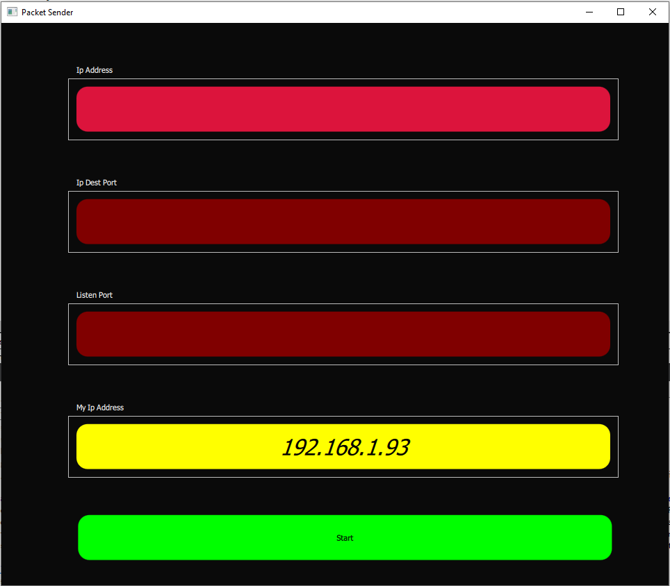
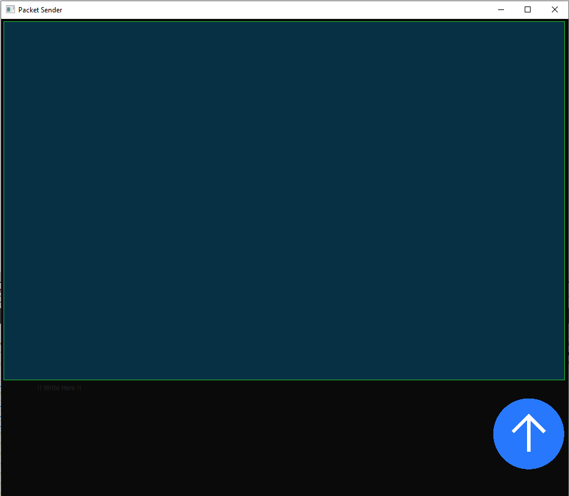
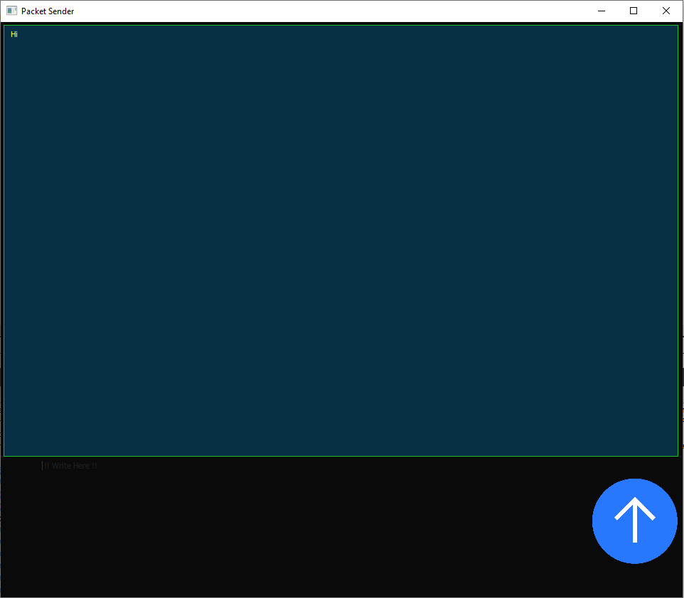

# Welcome to Packet Seneder Lite!

Hi! I'm Edoardo and i'm a student of Sapienza University and a worker. This repository was made into my free time for have fun. 

## _The Packet Sender Lite is a small and funny way to exchange message between two devices_

## Feature
This program allow to exchange only UDP packet. This project is made only for test and gain knowledge with QML.
I hope that this example is helpful for you!
ENJOY :)

## Figure

